# BÁO CÁO PHÂN TÍCH VÀ THIẾT KẾ - 3 USE CASE CHÍNH

Hệ thống Quản lý Thư viện (Library Management System) - Phân tích 3 chức năng nghiệp vụ chính: Mượn sách, Trả sách, Gia hạn.

## Bảng thuật ngữ

| Ký hiệu | Ý nghĩa |
|----------|---------|
| PM | Phần mềm Quản lý Thư viện |
| Thu_Thu | Thủ thư - nhân viên thư viện |
| Doc_Gia | Độc giả - người sử dụng dịch vụ |
| Sach | Đối tượng sách (mã, tiêu đề, tác giả, counters bản sao) |
| Phieu_Muon | Bản ghi mượn sách (mã phiếu, ngày mượn, hạn trả, tiền phạt) |
| So_Muon_Tra | Sổ ghi chép mượn trả sách (thủ công) |
| The_Doc_Gia | Thẻ độc giả vật lý |

**3 Use Case:** UC01: Mượn sách | UC02: Trả sách | UC03: Gia hạn mượn sách

---

# PHẦN 1: MÔ TẢ MÔI TRƯỜNG VẬN HÀNH

## 1a) Mô hình vận hành cũ (Thủ công)

**UC01 - Mượn sách:** Độc giả đưa thẻ cho thủ thư. Thủ thư kiểm tra thẻ bằng mắt, tra sổ danh mục sách, ghi thông tin vào sổ mượn trả (mã độc giả, mã sách, ngày mượn, hạn trả 14 ngày), đóng dấu phiếu mượn giấy và giao sách.

**UC02 - Trả sách:** Thủ thư đối chiếu phiếu mượn với sổ, kiểm tra hạn trả, tính tiền phạt thủ công (số ngày quá hạn × đơn giá), ghi ngày trả vào sổ, thu tiền phạt.

**UC03 - Gia hạn:** Thủ thư tra sổ tìm bản ghi, gạch hạn trả cũ và ghi hạn trả mới (+7 ngày).

### Lược đồ cộng tác - Mô hình cũ

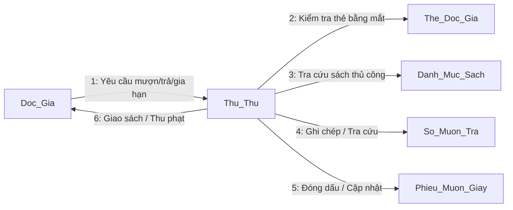

**Ưu điểm:** Không cần công nghệ, dễ triển khai, không phụ thuộc điện/mạng

**Khuyết điểm:** Tốn 5-10 phút/giao dịch, dễ sai sót, khó thống kê, không phát hiện được quá hạn

---

## 1b) Mô hình vận hành mới có PM

**Actors:** Thu_Thu, Doc_Gia, PM (Hệ thống)

### UC01: Mượn sách (Có PM)

1. Độc giả đưa thẻ + sách cho thủ thư
2. Thủ thư tìm kiếm độc giả trên PM (theo mã, tên, email hoặc SĐT - hỗ trợ không dấu)
3. PM hiển thị danh sách kết quả, thủ thư chọn độc giả
4. PM kiểm tra hợp lệ (tồn tại + thẻ chưa hết hạn)
5. Thủ thư tìm kiếm sách (theo mã, tiêu đề hoặc tác giả - hỗ trợ không dấu)
6. PM hiển thị sách kèm số khả dụng, thủ thư chọn sách có soKhaDung > 0
7. Thủ thư xác nhận → PM tạo Phieu_Muon (hanTra = ngayMuon + 14 ngày)
8. PM kiểm tra soKhaDung > 0 trong transaction, INSERT PhieuMuon (không UPDATE Sach)

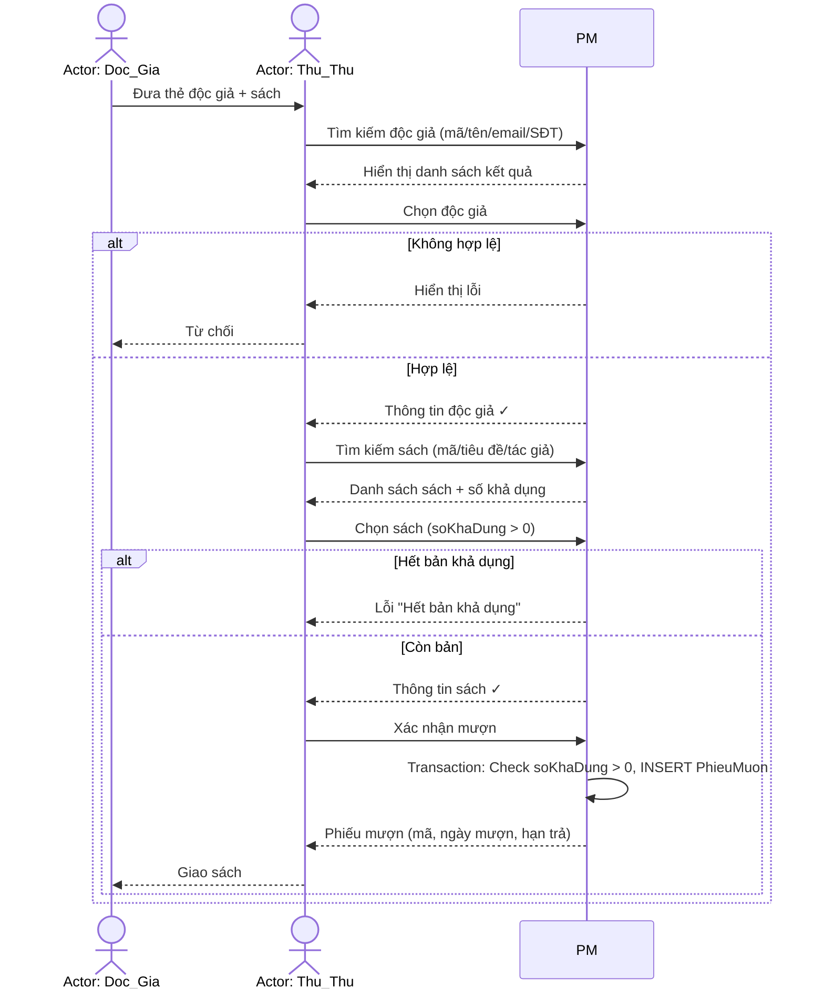

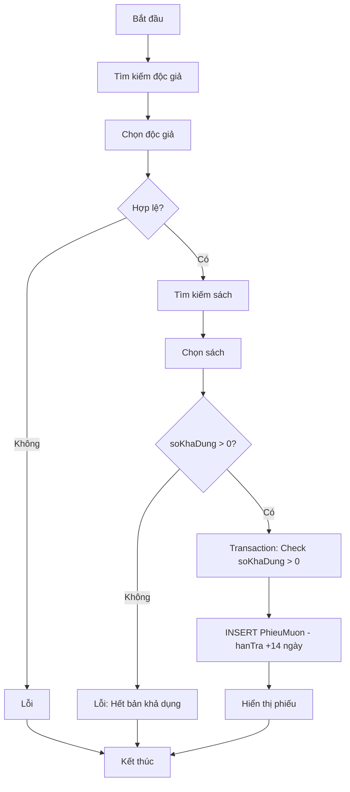

### UC02: Trả sách (Có PM)

1. Độc giả mang sách đến trả
2. Thủ thư tìm phiếu mượn (theo tên độc giả, tên sách, hoặc mã phiếu - dropdown chọn loại tìm)
3. PM hiển thị danh sách phiếu đang mượn kèm phạt ước tính
4. Thủ thư chọn phiếu → PM hiển thị chi tiết + tiền phạt tự động
5. Thủ thư xác nhận trả (hoặc đánh dấu mất sách + phí đền) → PM cập nhật trangThai = DA_TRA

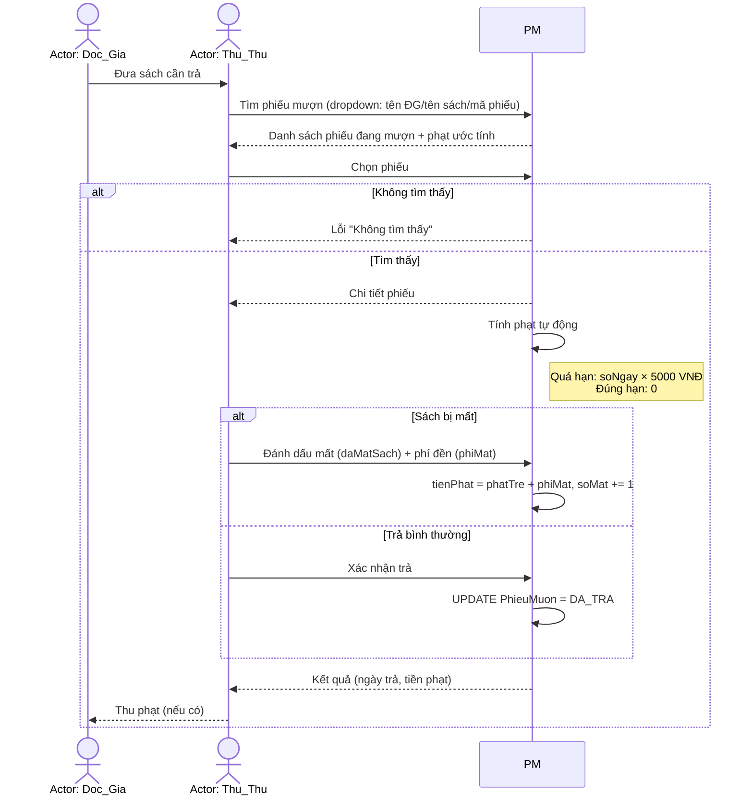

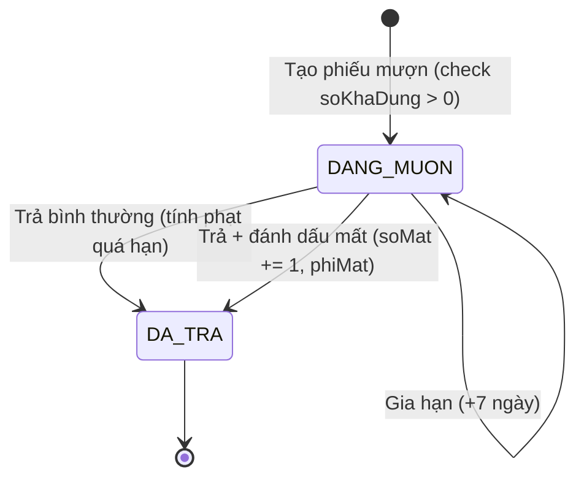

### UC03: Gia hạn (Có PM)

1. Thủ thư tìm phiếu mượn (dropdown chọn loại tìm + từ khóa)
2. PM hiển thị danh sách phiếu đang mượn
3. Thủ thư chọn phiếu → PM kiểm tra hợp lệ (trangThai = DANG_MUON)
4. Thủ thư yêu cầu gia hạn → PM cập nhật hanTra += 7 ngày

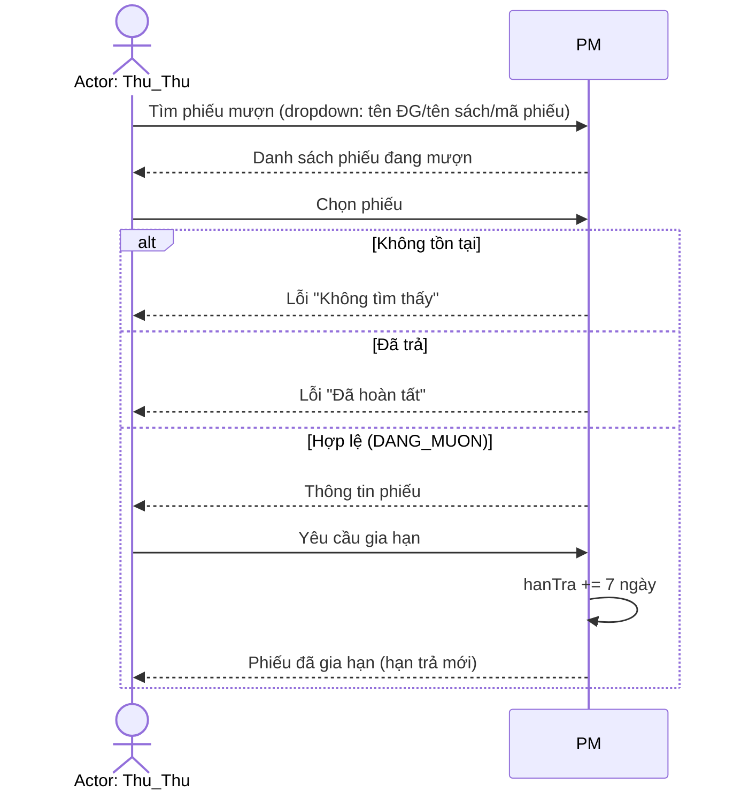

**Ưu điểm PM:** Xử lý 3-5 giây, tự động validate, tính phạt chính xác, tìm kiếm không dấu

**Khuyết điểm PM:** Cần đầu tư ban đầu, phụ thuộc điện/máy tính

| Tiêu chí | Thủ công | Có PM |
|----------|---------|-------|
| Thời gian giao dịch | 5-10 phút | 3-5 giây |
| Tra cứu | 5-15 phút | < 2 giây |
| Tính phạt | Thủ công, dễ sai | Tự động |
| Phát hiện quá hạn | Rất khó | Tự động |

---

# PHẦN 2: PHÂN TÍCH YÊU CẦU

## 2a) Phân tích đối tượng thành phần (CRC)

**UC01:** Doc_Gia (kiểm tra hợp lệ), Sach (kiểm tra soKhaDung), Phieu_Muon (tạo bản ghi)
**UC02:** Phieu_Muon (tìm, cập nhật, tính phạt), Sach (tăng soMat nếu mất)
**UC03:** Phieu_Muon (tìm, kiểm tra điều kiện, cập nhật hạn trả)

| Lớp | Trách nhiệm | Cộng tác |
|-----|------------|---------|
| Sach | Lưu trữ thông tin sách, tìm kiếm (không dấu), quản lý counters (soBanSao/soMat/soBaoTri), tính soKhaDung | Phieu_Muon |
| Doc_Gia | Lưu trữ thông tin độc giả, tìm kiếm (không dấu), kiểm tra hạn thẻ | Phieu_Muon |
| Phieu_Muon | Ghi nhận mượn sách, tính phạt, gia hạn, tìm kiếm | Sach, Doc_Gia |

## 2b) Tương tác chi tiết trên đối tượng

### UC01 - Mượn sách

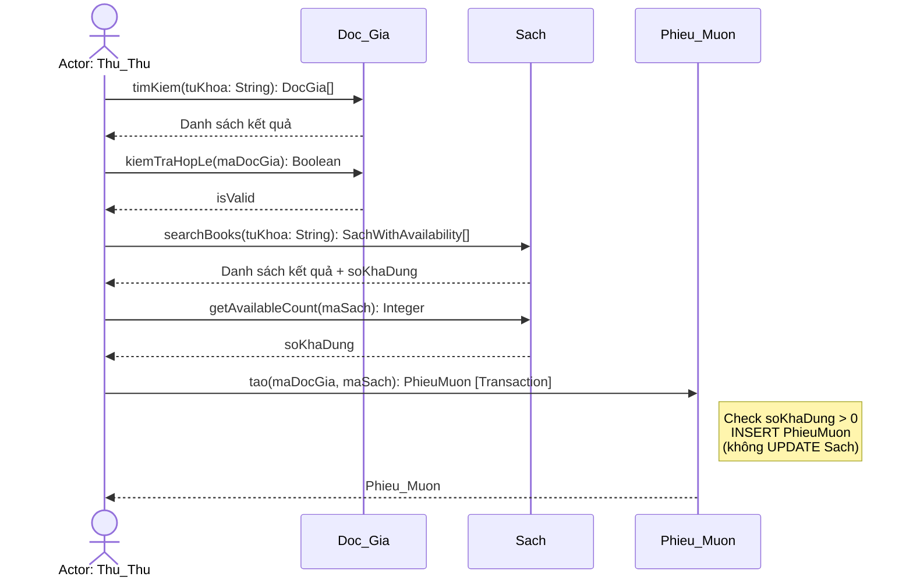

### UC02 - Trả sách

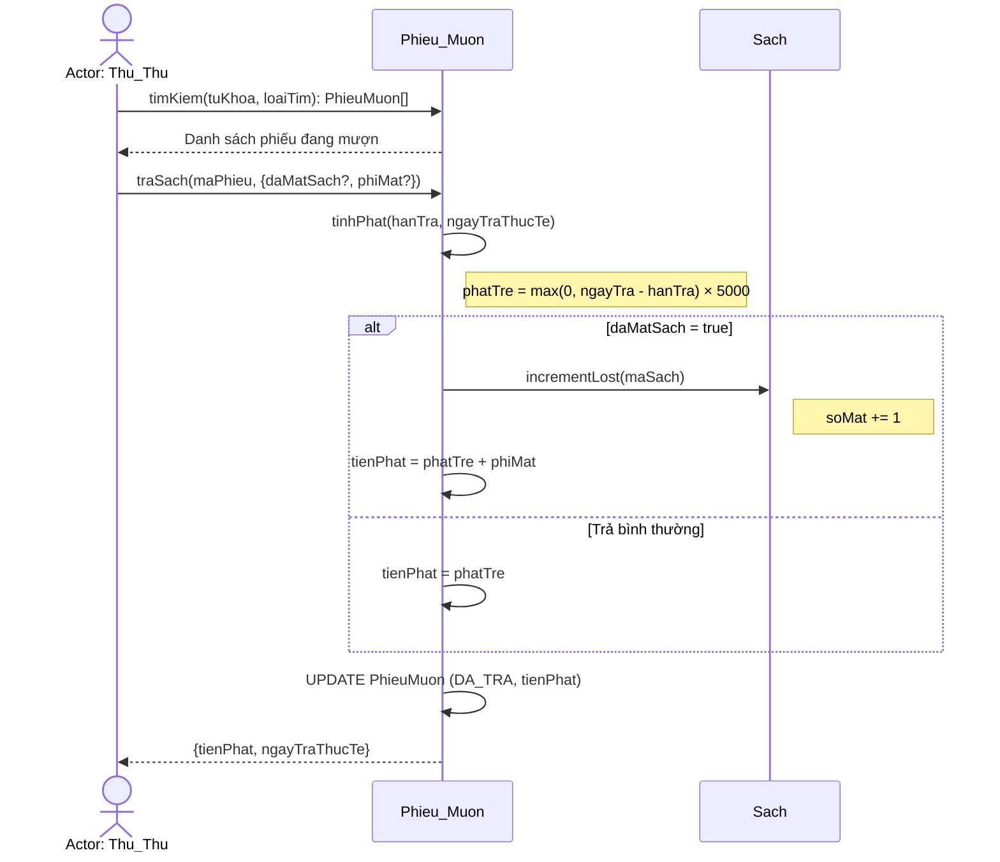

### UC03 - Gia hạn

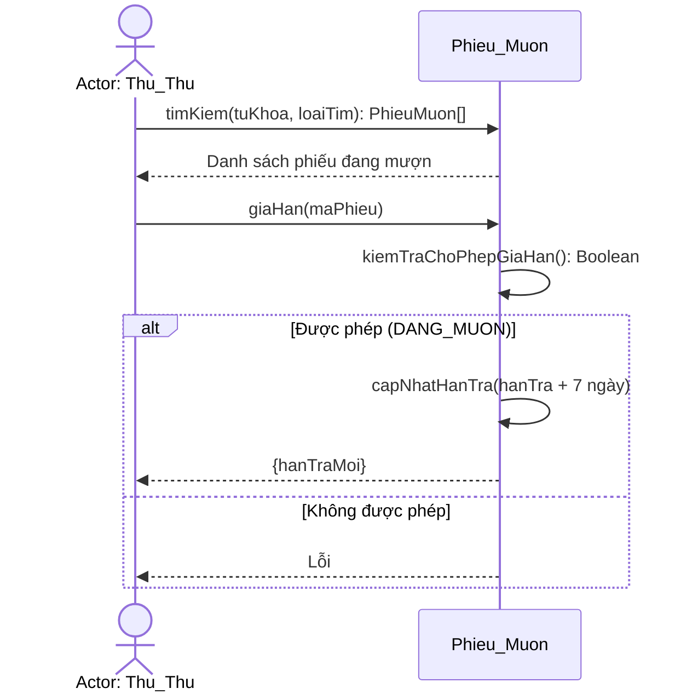

## 2c) Lược đồ lớp tổng quát lp-1

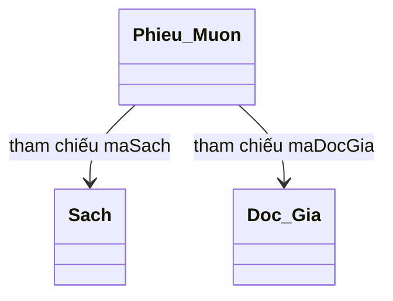

## 2d) Định nghĩa chi tiết các lớp

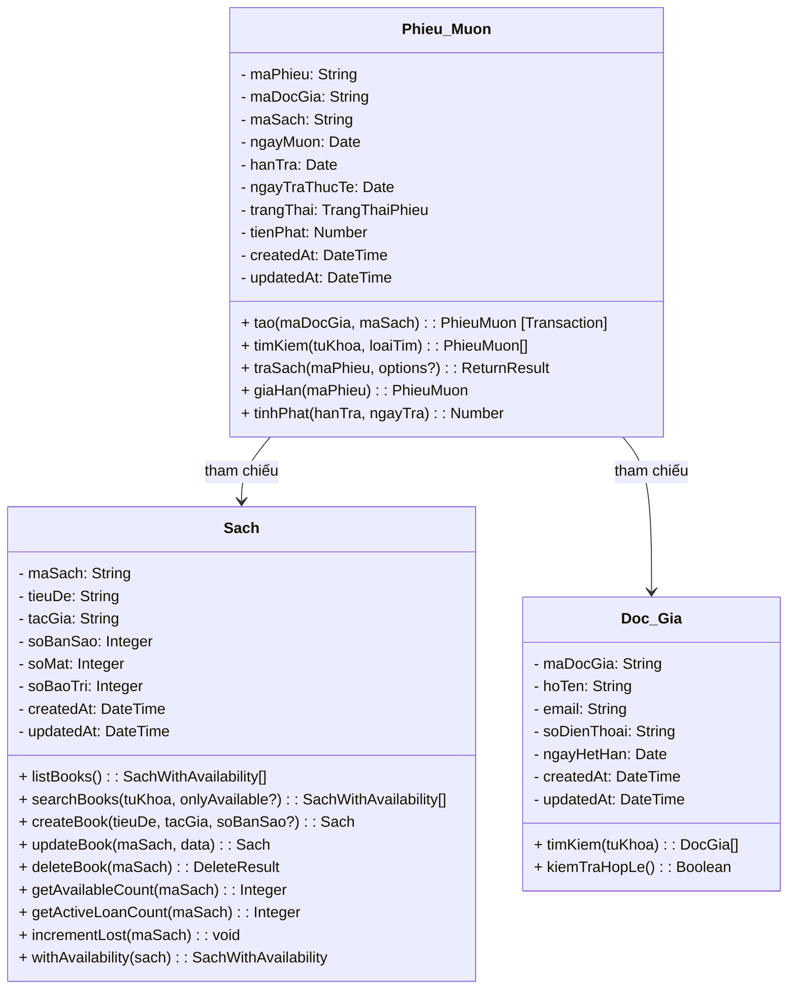

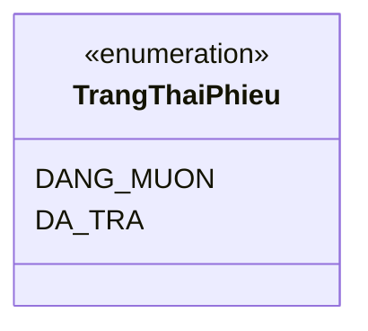

**Quy tắc nghiệp vụ:**
1. Tiền phạt trễ = soNgayQuaHan × 5000 VNĐ/ngày
2. Thời hạn mượn: 14 ngày
3. Gia hạn: +7 ngày vào hạn trả hiện tại
4. Mượn sách: soKhaDung > 0 (kiểm tra trong transaction)
5. Gia hạn: trangThai phải = DANG_MUON
6. Tạo phiếu mượn: sử dụng database transaction (atomic)
7. Trả sách có thể đánh dấu mất: tienPhat = phatTre + phiMat, soMat += 1

---

# PHẦN 3: THIẾT KẾ HỆ THỐNG

## 3a) Mô đun thiết kế

Kiến trúc phân lớp:

```
  Giao diện (Web SPA)  →  Xử lý nghiệp vụ  →  CSDL (SQLite)
```

**Segmentation:**

| Mô đun | Đối tượng nghiệp vụ |
|--------|---------------------|
| mod-borrow | Phieu_Muon (mượn, trả, gia hạn, tính phạt) |
| mod-reader | Doc_Gia (tìm kiếm, kiểm tra hợp lệ) |
| mod-book | Sach (tìm kiếm, quản lý counters, tính soKhaDung) |

**Factoring:**

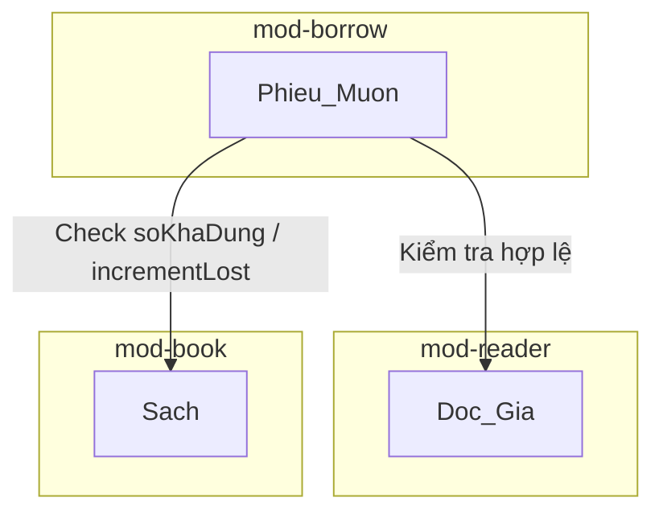

## 3b) Liên kết Giao diện - Xử lý - Database

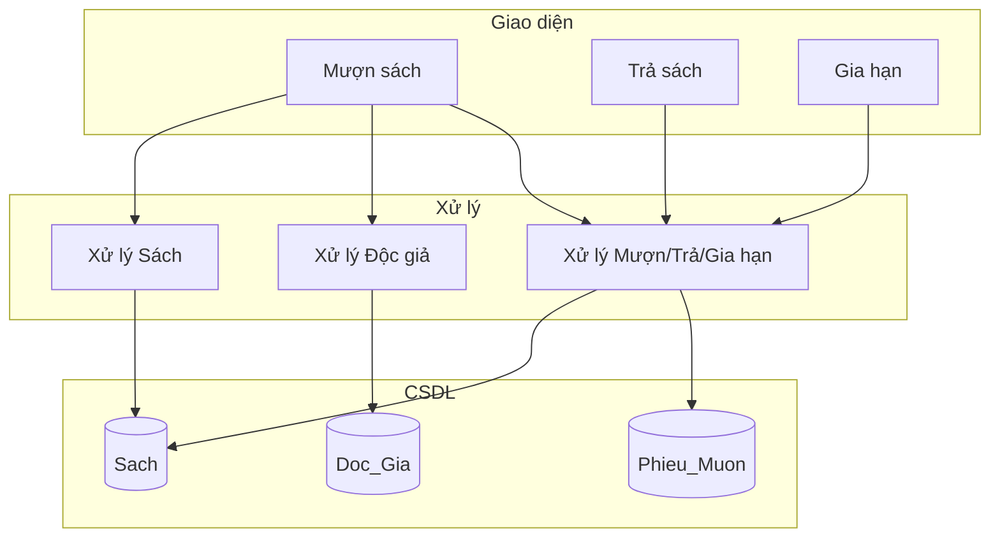

**Lược đồ quan hệ dữ liệu:**

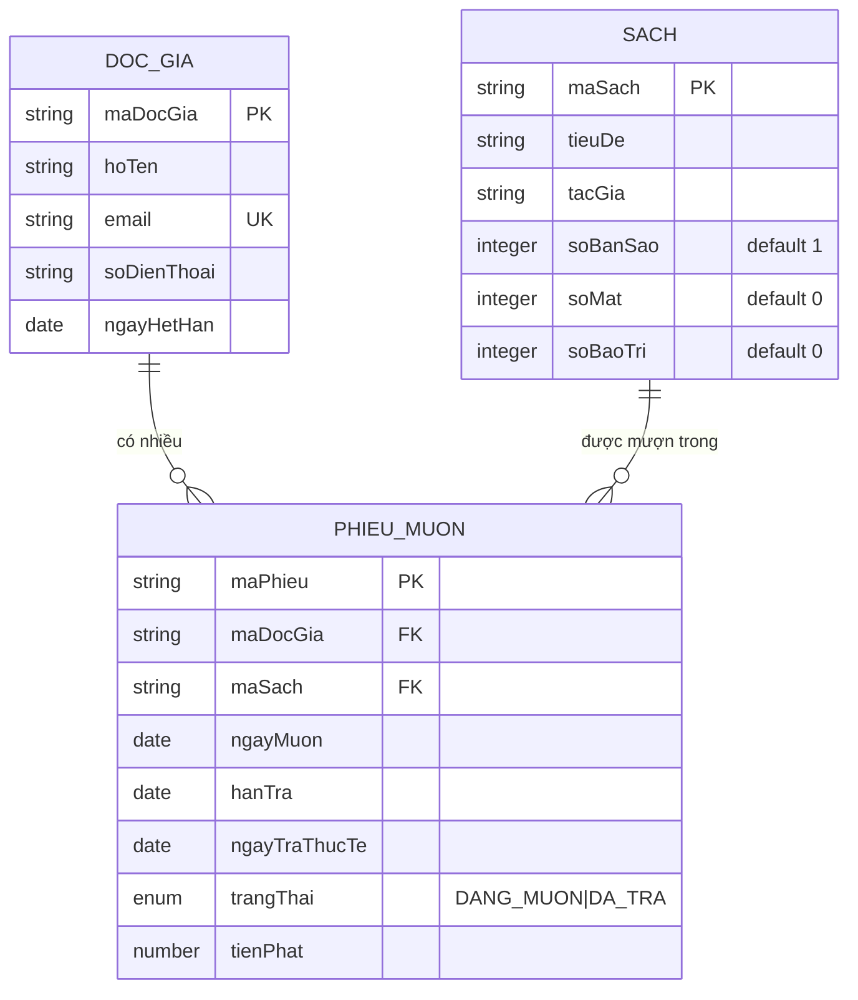

## 3c) Quy trình vận hành trên giao diện

**Mượn sách** — Wizard 3 bước:
- Bước 1: Tìm độc giả (đa trường, không dấu) → bảng kết quả → Chọn
- Bước 2: Tìm sách (đa trường, không dấu) → bảng kết quả → Chọn (chỉ soKhaDung > 0)
- Bước 3: Xác nhận → Phiếu mượn

**Trả sách** — 2 bước:
- Bước 1: Tìm phiếu (dropdown loại tìm + từ khóa) → bảng phiếu + phạt ước tính → Chọn
- Bước 2: Xác nhận trả (hoặc đánh dấu mất + phí đền) → Kết quả (ngày trả, tiền phạt)

**Gia hạn** — 2 bước:
- Bước 1: Tìm phiếu (dropdown loại tìm + từ khóa) → bảng phiếu → Chọn
- Bước 2: Gia hạn +7 ngày → Hạn trả mới
