# BÁO CÁO PHÂN TÍCH VÀ THIẾT KẾ HỆ THỐNG QUẢN LÝ THƯ VIỆN

Hệ thống Quản lý Thư viện (Library Management System) là phần mềm (PM) hỗ trợ thủ thư và độc giả trong việc quản lý sách, mượn/trả sách, tra cứu và thống kê. Hệ thống thay thế quy trình thủ công bằng cơ sở dữ liệu tập trung.

## Bảng thuật ngữ

| Ký hiệu | Ý nghĩa |
|----------|---------|
| PM | Phần mềm Quản lý Thư viện |
| He_Thong | Hệ thống quản lý thư viện |
| Thu_Thu | Thủ thư - nhân viên thư viện |
| Doc_Gia | Độc giả - người sử dụng dịch vụ |
| Sach | Đối tượng sách (mã, tiêu đề, tác giả, tình trạng) |
| Phieu_Muon | Bản ghi mượn sách (mã phiếu, ngày mượn, hạn trả, tiền phạt) |
| Tai_Khoan | Tài khoản đăng nhập hệ thống |
| So_Muon_Tra | Sổ ghi chép mượn trả sách (thủ công) |
| The_Doc_Gia | Thẻ độc giả vật lý |

**3 Use Case chính:** UC01: Mượn sách | UC02: Trả sách | UC03: Gia hạn mượn sách

---

# PHẦN 1: MÔ TẢ MÔI TRƯỜNG VẬN HÀNH

## 1a) Mô hình vận hành cũ (Thủ công)

**UC01 - Mượn sách:** Độc giả đưa thẻ cho thủ thư. Thủ thư kiểm tra thẻ bằng mắt, tra sổ danh mục sách, ghi thông tin vào sổ mượn trả (mã độc giả, mã sách, ngày mượn, hạn trả 14 ngày), đóng dấu phiếu mượn giấy và giao sách.

**UC02 - Trả sách:** Thủ thư đối chiếu phiếu mượn với sổ, kiểm tra hạn trả, tính tiền phạt thủ công (số ngày quá hạn × đơn giá), ghi ngày trả vào sổ, thu tiền phạt.

**UC03 - Gia hạn:** Thủ thư tra sổ tìm bản ghi, gạch hạn trả cũ và ghi hạn trả mới (+7 ngày).

### Lược đồ cộng tác - Mô hình cũ

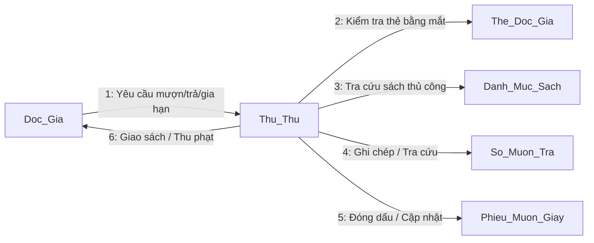

**Ưu điểm:** Không cần công nghệ, dễ triển khai, không phụ thuộc điện/mạng

**Khuyết điểm:** Tốn 5-10 phút/giao dịch, dễ sai sót, khó thống kê, không phát hiện được quá hạn

---

## 1b) Mô hình vận hành mới có PM

**Actors:** Thu_Thu, Doc_Gia, PM (He_Thong)
**Use Case hỗ trợ:** Đăng nhập, Xác nhận giao dịch

### UC01: Mượn sách (Có PM)

1. Độc giả đưa thẻ + sách cho thủ thư
2. Thủ thư tìm kiếm độc giả trên PM (theo mã, tên, email hoặc SĐT)
3. PM hiển thị danh sách kết quả, thủ thư chọn độc giả
4. PM kiểm tra hợp lệ (tồn tại + thẻ chưa hết hạn)
5. Thủ thư tìm kiếm sách (theo mã, tiêu đề hoặc tác giả)
6. PM hiển thị sách kèm tình trạng, thủ thư chọn sách sẵn sàng
7. Thủ thư xác nhận → PM tạo Phieu_Muon (hanTra = ngayMuon + 14 ngày)
8. PM cập nhật Sach.tinhTrang = DA_MUON

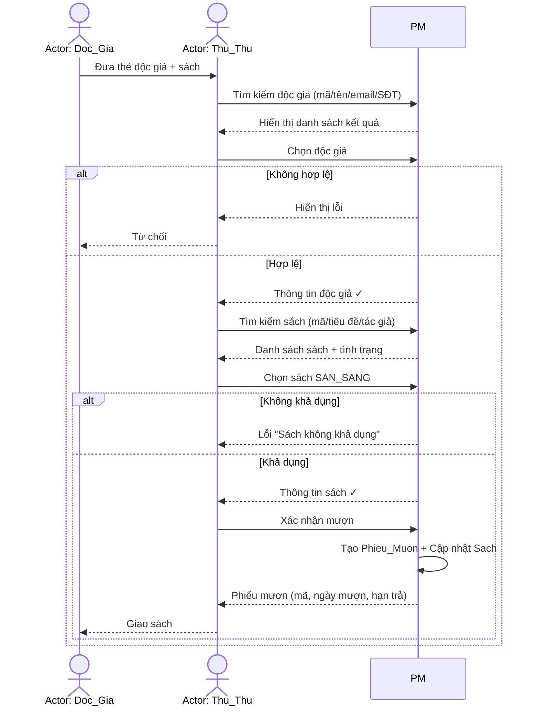

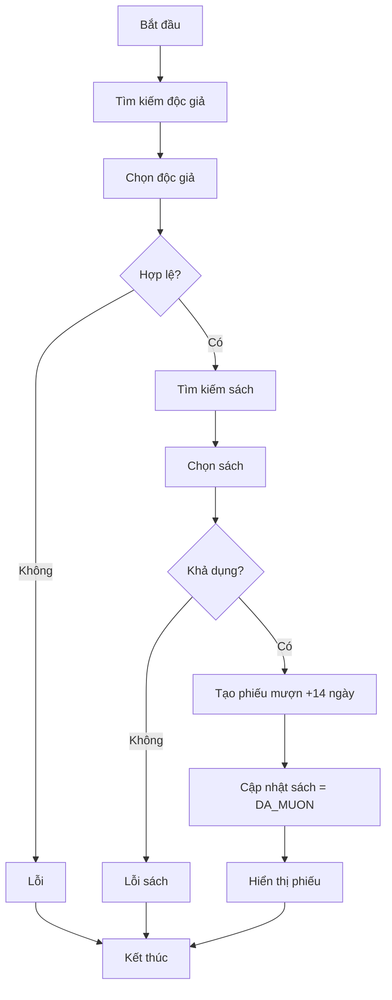

### UC02: Trả sách (Có PM)

1. Độc giả mang sách đến trả
2. Thủ thư tìm phiếu mượn (theo tên độc giả, tên sách, hoặc mã phiếu)
3. PM hiển thị danh sách phiếu đang mượn kèm phạt ước tính
4. Thủ thư chọn phiếu → PM hiển thị chi tiết + tiền phạt tự động
5. Thủ thư xác nhận → PM cập nhật trangThai = DA_TRA, Sach = SAN_SANG

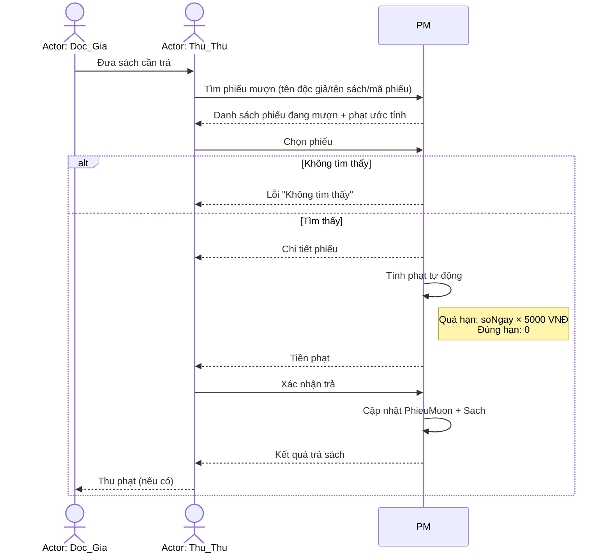

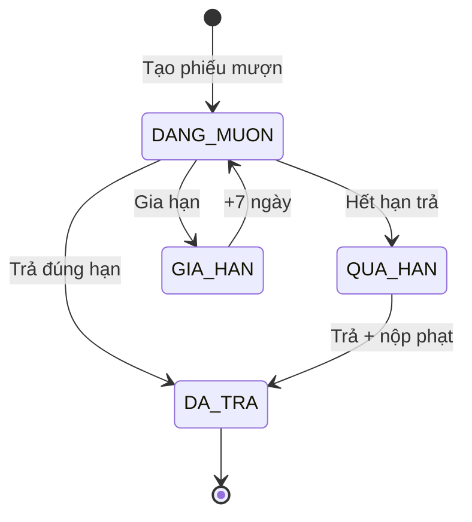

### UC03: Gia hạn (Có PM)

1. Thủ thư nhập mã phiếu → PM tìm Phieu_Muon
2. PM kiểm tra hợp lệ (trangThai = DANG_MUON)
3. Thủ thư yêu cầu gia hạn → PM cập nhật hanTra += 7 ngày

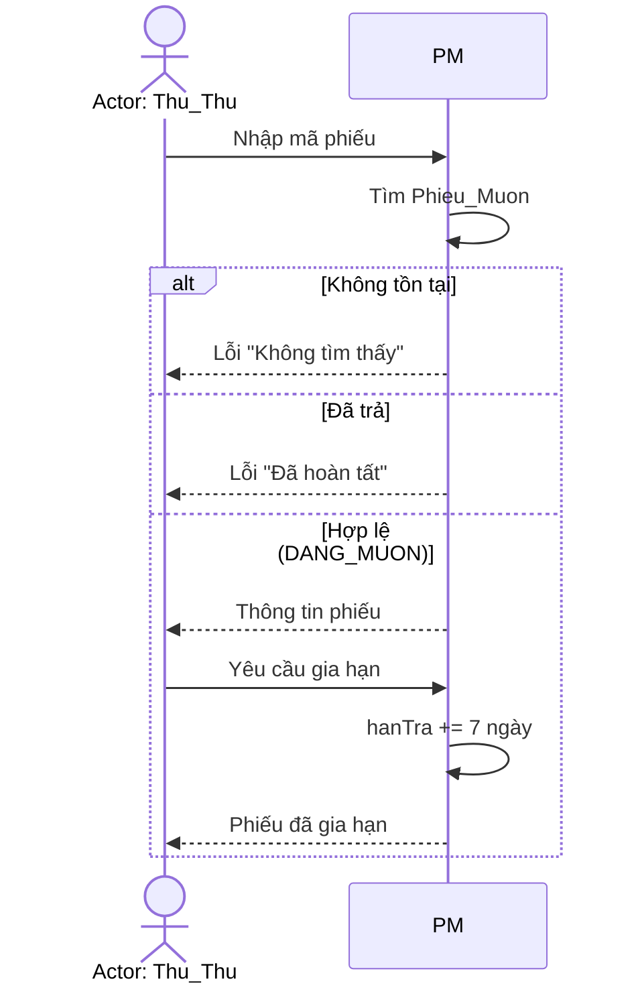

**Ưu điểm PM:** Xử lý 3-5 giây, tự động validate, tính phạt chính xác, tìm kiếm không dấu, báo cáo tức thì

**Khuyết điểm PM:** Cần đầu tư ban đầu, phụ thuộc điện/máy tính, cần bảo trì

| Tiêu chí | Thủ công | Có PM |
|----------|---------|-------|
| Thời gian giao dịch | 5-10 phút | 3-5 giây |
| Tra cứu | 5-15 phút | < 2 giây |
| Tính phạt | Thủ công, dễ sai | Tự động |
| Phát hiện quá hạn | Rất khó | Tự động |

---

# PHẦN 2: PHÂN TÍCH YÊU CẦU

## 2a) Phân tích đối tượng thành phần (CRC)

**UC01:** Doc_Gia (kiểm tra hợp lệ), Sach (kiểm tra khả dụng), Phieu_Muon (tạo bản ghi)
**UC02:** Phieu_Muon (tìm, cập nhật, tính phạt), Sach (cập nhật trạng thái)
**UC03:** Phieu_Muon (tìm, kiểm tra điều kiện, cập nhật hạn trả)

| Lớp | Trách nhiệm | Cộng tác |
|-----|------------|---------|
| Sach | Lưu trữ thông tin sách, cập nhật trạng thái | Phieu_Muon |
| Doc_Gia | Lưu trữ thông tin độc giả, kiểm tra hạn thẻ | Phieu_Muon |
| Phieu_Muon | Ghi nhận mượn sách, tính phạt, gia hạn | Sach, Doc_Gia |
| Tai_Khoan | Xác thực đăng nhập, phân quyền | Thu_Thu |

## 2b) Tương tác chi tiết trên đối tượng

### UC01 - Mượn sách

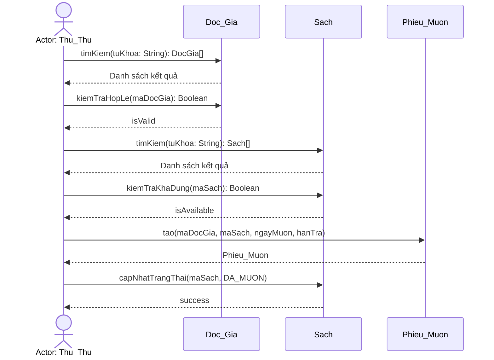

### UC02 - Trả sách

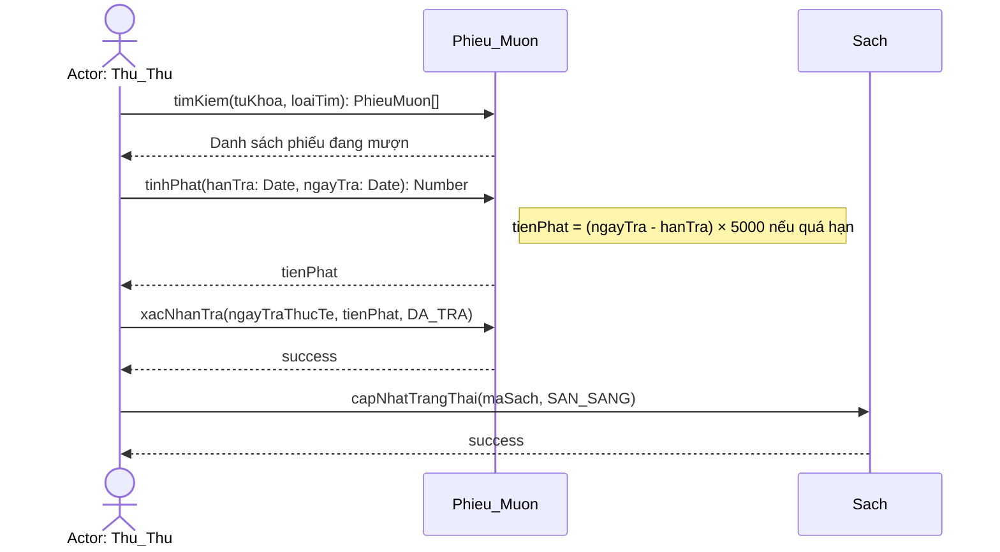

### UC03 - Gia hạn

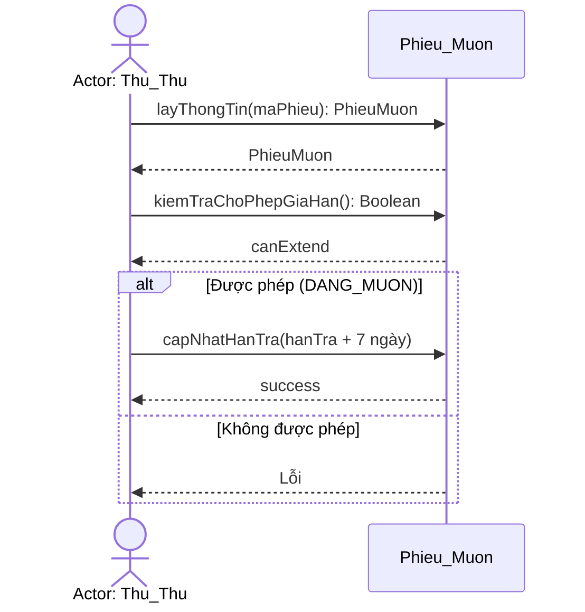

## 2c) Lược đồ lớp tổng quát lp-1

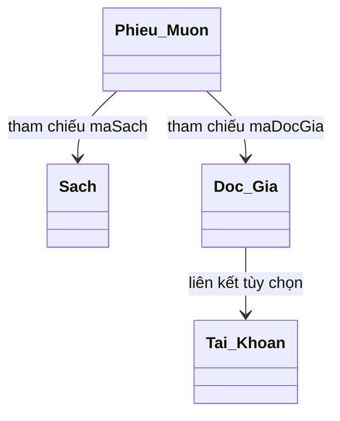

## 2d) Định nghĩa chi tiết các lớp

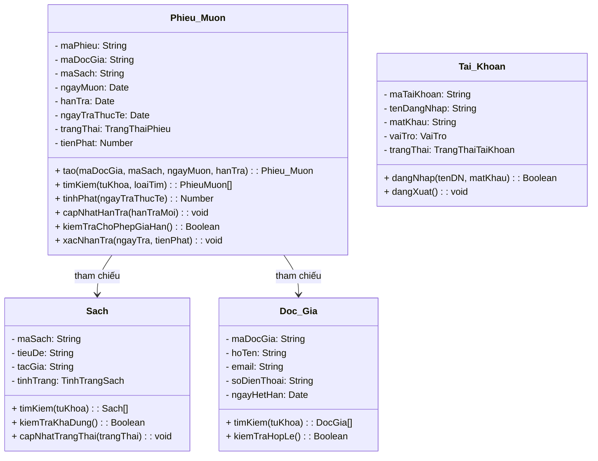

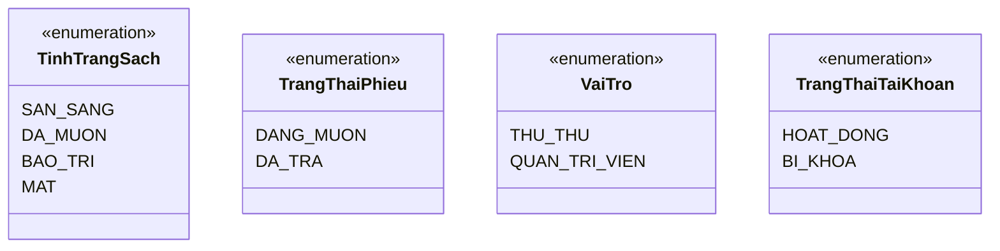

**Quy tắc nghiệp vụ:**
1. Tiền phạt = soNgayQuaHan × 5000 VNĐ/ngày
2. Thời hạn mượn: 14 ngày
3. Gia hạn: +7 ngày vào hạn trả hiện tại
4. Mượn sách: tinhTrang phải = SAN_SANG
5. Gia hạn: trangThai phải = DANG_MUON
6. Xóa độc giả: không có phiếu DANG_MUON
7. Xóa sách: tinhTrang ≠ DA_MUON

---

# PHẦN 3: THIẾT KẾ HỆ THỐNG

## 3a) Mô đun thiết kế

Kiến trúc phân lớp 3 tầng:

```
  Presentation Layer (Giao diện web SPA, tiếng Việt, responsive)
       ↓
  Business Logic Layer (Xử lý mượn/trả/gia hạn, quản lý, tra cứu, xác thực, báo cáo)
       ↓
  Data Access Layer (CSDL quan hệ: Doc_Gia, Sach, Phieu_Muon, Tai_Khoan)
```

**Segmentation:**

| Mô đun | Đối tượng nghiệp vụ |
|--------|---------------------|
| mod-auth | Tai_Khoan (đăng nhập, phân quyền) |
| mod-borrow | Phieu_Muon (mượn, trả, gia hạn, tính phạt) |
| mod-reader | Doc_Gia (quản lý độc giả) |
| mod-book | Sach (quản lý sách, tra cứu) |
| mod-report | Báo cáo (quá hạn, tình trạng kho) |

**Factoring:**

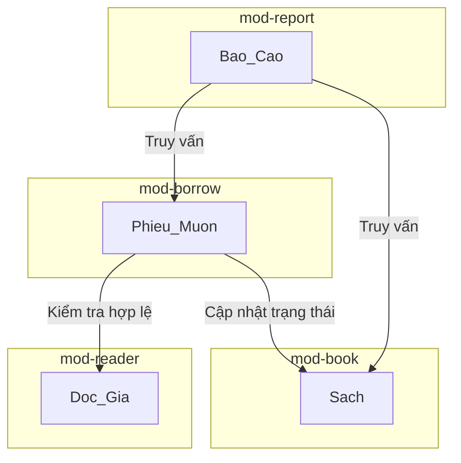

## 3b) Liên kết Giao diện - Xử lý - Database

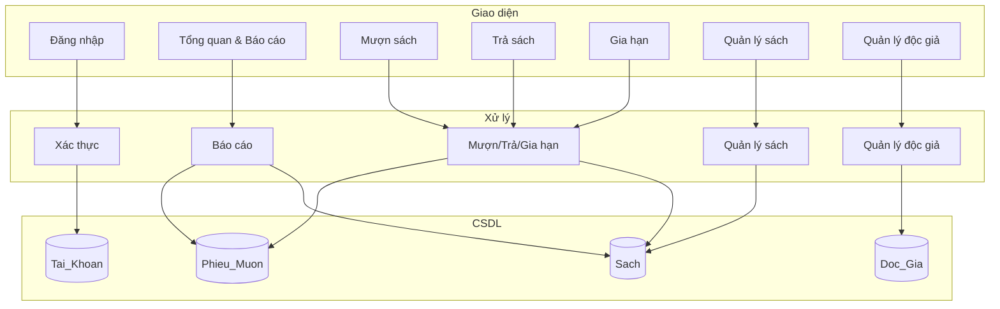

**Lược đồ quan hệ dữ liệu:**

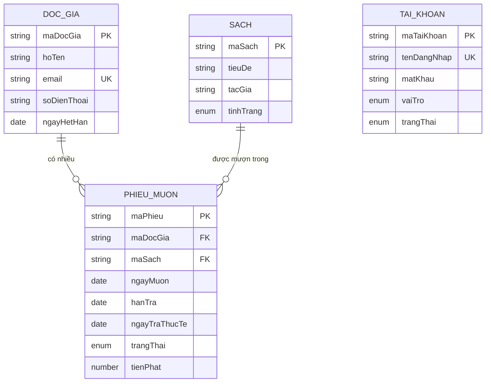

## 3c) Quy trình vận hành trên giao diện

**Layout:** Sidebar trái (3 nhóm: Menu chính, Quản lý, Báo cáo) + Header + Vùng nội dung

**Mượn sách** — Wizard 3 bước:
- Bước 1: Tìm độc giả (đa trường, không dấu) → bảng kết quả → Chọn
- Bước 2: Tìm sách (đa trường, không dấu) → bảng kết quả → Chọn (chỉ SẴN SÀNG)
- Bước 3: Xác nhận → Phiếu mượn

**Trả sách** — 2 bước:
- Bước 1: Tìm phiếu (dropdown loại tìm + từ khóa) → bảng phiếu + phạt ước tính → Chọn
- Bước 2: Xác nhận trả → Kết quả (ngày trả, tiền phạt)

**Gia hạn** — 2 bước:
- Bước 1: Nhập mã phiếu → Thông tin phiếu
- Bước 2: Gia hạn +7 ngày → Hạn trả mới

**Quản lý sách:** Tìm kiếm + bảng CRUD + không xóa được sách đang mượn
**Quản lý độc giả:** Bảng CRUD + không xóa được độc giả đang mượn
**Đăng nhập:** Form tên đăng nhập + mật khẩu, phân quyền Thủ thư / Quản trị viên
