# BÁO CÁO PHÂN TÍCH VÀ THIẾT KẾ HỆ THỐNG QUẢN LÝ THƯ VIỆN

Hệ thống Quản lý Thư viện (Library Management System) là phần mềm (PM) hỗ trợ thủ thư và quản trị viên trong việc quản lý sách, mượn/trả sách, tra cứu, thống kê và quản lý tài khoản. Hệ thống thay thế quy trình thủ công bằng cơ sở dữ liệu tập trung.

## Bảng thuật ngữ

| Ký hiệu | Ý nghĩa |
|----------|---------|
| PM | Phần mềm Quản lý Thư viện |
| He_Thong | Hệ thống quản lý thư viện |
| Thu_Thu | Thủ thư - nhân viên thư viện |
| Quan_Tri | Quản trị viên - người quản lý hệ thống |
| Doc_Gia | Độc giả - người sử dụng dịch vụ |
| Sach | Đối tượng sách (mã, tiêu đề, tác giả, counters bản sao) |
| Phieu_Muon | Bản ghi mượn sách (mã phiếu, ngày mượn, hạn trả, tiền phạt) |
| Tai_Khoan | Tài khoản đăng nhập hệ thống |
| So_Muon_Tra | Sổ ghi chép mượn trả sách (thủ công) |
| The_Doc_Gia | Thẻ độc giả vật lý |

**4 Use Case chính:** UC01: Mượn sách | UC02: Trả sách | UC03: Gia hạn mượn sách | UC04: Quản lý tài khoản

---

# PHẦN 1: MÔ TẢ MÔI TRƯỜNG VẬN HÀNH

## 1a) Mô hình vận hành cũ (Thủ công)

**UC01 - Mượn sách:** Độc giả đưa thẻ cho thủ thư. Thủ thư kiểm tra thẻ bằng mắt, tra sổ danh mục sách, ghi thông tin vào sổ mượn trả (mã độc giả, mã sách, ngày mượn, hạn trả 14 ngày), đóng dấu phiếu mượn giấy và giao sách.

**UC02 - Trả sách:** Thủ thư đối chiếu phiếu mượn với sổ, kiểm tra hạn trả, tính tiền phạt thủ công (số ngày quá hạn × đơn giá), ghi ngày trả vào sổ, thu tiền phạt.

**UC03 - Gia hạn:** Thủ thư tra sổ tìm bản ghi, gạch hạn trả cũ và ghi hạn trả mới (+7 ngày).

**UC04 - Quản lý tài khoản:** Không có trong mô hình cũ (chỉ 1 người quản lý).

### Lược đồ cộng tác - Mô hình cũ

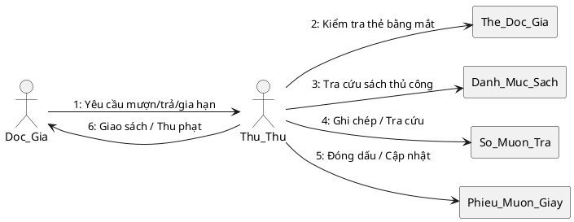

**Ưu điểm:** Không cần công nghệ, dễ triển khai, không phụ thuộc điện/mạng

**Khuyết điểm:** Tốn 5-10 phút/giao dịch, dễ sai sót, khó thống kê, không phát hiện được quá hạn

---

## 1b) Mô hình vận hành mới có PM

**Actors:** Thu_Thu, Quan_Tri, Doc_Gia, PM (He_Thong)
**Use Case hỗ trợ:** Đăng nhập, Xác nhận giao dịch, Phân quyền

### UC01: Mượn sách (Có PM)

1. Độc giả đưa thẻ + sách cho thủ thư
2. Thủ thư tìm kiếm độc giả trên PM (theo mã, tên, email hoặc SĐT - hỗ trợ không dấu)
3. PM hiển thị danh sách kết quả, thủ thư chọn độc giả
4. PM kiểm tra hợp lệ (tồn tại + thẻ chưa hết hạn)
5. Thủ thư tìm kiếm sách (theo mã, tiêu đề hoặc tác giả - hỗ trợ không dấu)
6. PM hiển thị sách kèm số khả dụng, thủ thư chọn sách có soKhaDung > 0
7. Thủ thư xác nhận → PM tạo Phieu_Muon (hanTra = ngayMuon + 14 ngày)
8. PM kiểm tra soKhaDung > 0 trong transaction, INSERT PhieuMuon (không UPDATE Sach)

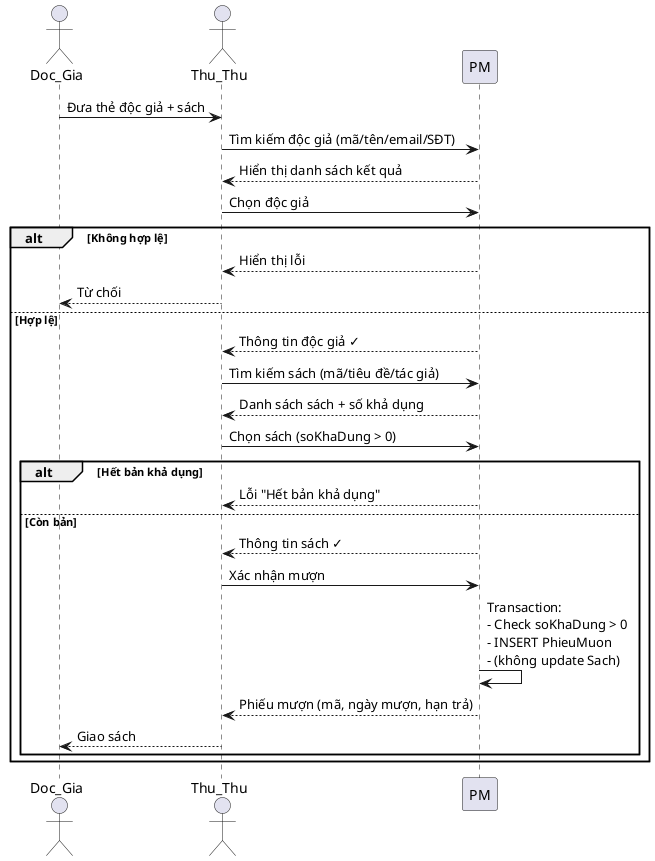

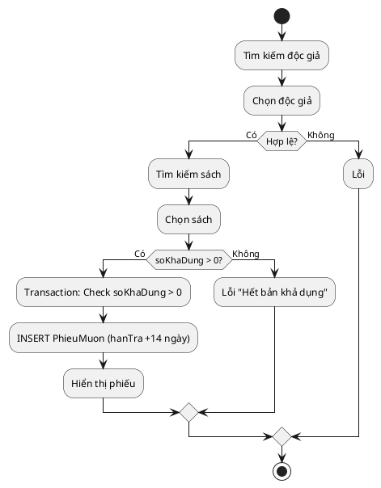

### UC02: Trả sách (Có PM)

1. Độc giả mang sách đến trả
2. Thủ thư tìm phiếu mượn (theo tên độc giả, tên sách, hoặc mã phiếu - dropdown chọn loại tìm)
3. PM hiển thị danh sách phiếu đang mượn kèm phạt ước tính
4. Thủ thư chọn phiếu → PM hiển thị chi tiết + tiền phạt tự động
5. Thủ thư xác nhận trả (hoặc đánh dấu mất sách + phí đền) → PM cập nhật trangThai = DA_TRA

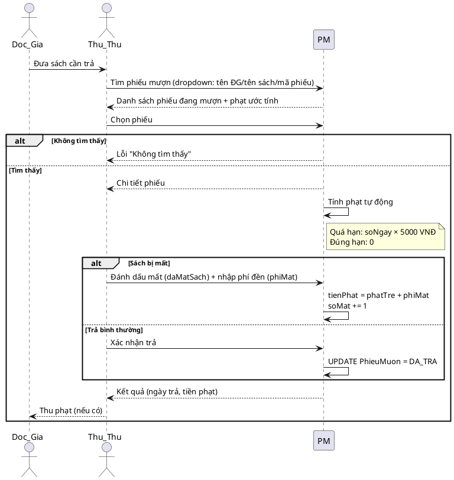

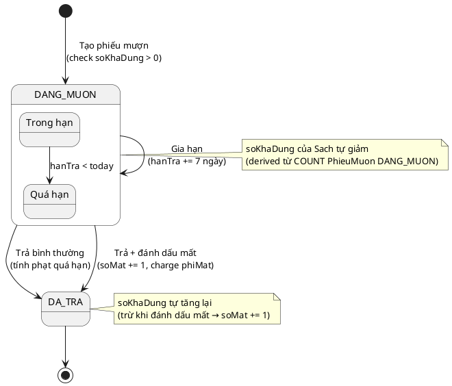

### UC03: Gia hạn (Có PM)

1. Thủ thư tìm phiếu mượn (dropdown chọn loại tìm + từ khóa)
2. PM hiển thị danh sách phiếu đang mượn
3. Thủ thư chọn phiếu → PM kiểm tra hợp lệ (trangThai = DANG_MUON)
4. Thủ thư yêu cầu gia hạn → PM cập nhật hanTra += 7 ngày

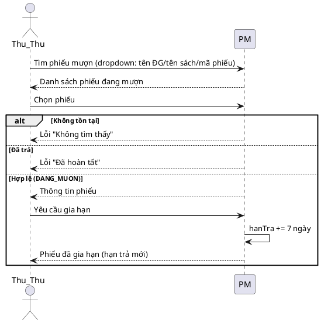

### UC04: Quản lý tài khoản (Có PM - Chỉ Quản trị viên)

1. Quản trị viên đăng nhập → PM kiểm tra vaiTro = QUAN_TRI_VIEN
2. Quản trị viên truy cập trang Tài khoản → PM hiển thị danh sách tài khoản
3. Quản trị viên có thể: Tạo mới, Khóa/Mở khóa, Đổi mật khẩu, Xóa tài khoản

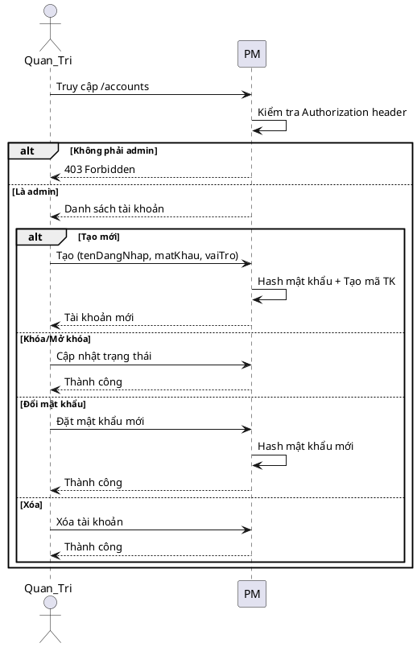

**Ưu điểm PM:** Xử lý 3-5 giây, tự động validate, tính phạt chính xác, tìm kiếm không dấu, báo cáo tức thì, phân quyền rõ ràng

**Khuyết điểm PM:** Cần đầu tư ban đầu, phụ thuộc điện/máy tính, cần bảo trì

| Tiêu chí | Thủ công | Có PM |
|----------|---------|-------|
| Thời gian giao dịch | 5-10 phút | 3-5 giây |
| Tra cứu | 5-15 phút | < 2 giây |
| Tính phạt | Thủ công, dễ sai | Tự động |
| Phát hiện quá hạn | Rất khó | Tự động |
| Phân quyền | Không có | Admin/Thủ thư |

---

# PHẦN 2: PHÂN TÍCH YÊU CẦU

## 2a) Phân tích đối tượng thành phần (CRC)

**UC01:** Doc_Gia (kiểm tra hợp lệ), Sach (kiểm tra soKhaDung), Phieu_Muon (tạo bản ghi)
**UC02:** Phieu_Muon (tìm, cập nhật, tính phạt), Sach (tăng soMat nếu mất)
**UC03:** Phieu_Muon (tìm, kiểm tra điều kiện, cập nhật hạn trả)
**UC04:** Tai_Khoan (CRUD, phân quyền, hash mật khẩu)

| Lớp | Trách nhiệm | Cộng tác |
|-----|------------|---------|
| Sach | Lưu trữ thông tin sách, CRUD, tìm kiếm (không dấu), quản lý counters, tính soKhaDung | Phieu_Muon |
| Doc_Gia | Lưu trữ thông tin độc giả, CRUD, tìm kiếm (không dấu), kiểm tra hạn thẻ | Phieu_Muon |
| Phieu_Muon | Ghi nhận mượn sách, tính phạt, gia hạn, tìm kiếm | Sach, Doc_Gia |
| Tai_Khoan | Xác thực đăng nhập, phân quyền, CRUD tài khoản, hash mật khẩu | Thu_Thu, Quan_Tri |

## 2b) Tương tác chi tiết trên đối tượng

### UC01 - Mượn sách

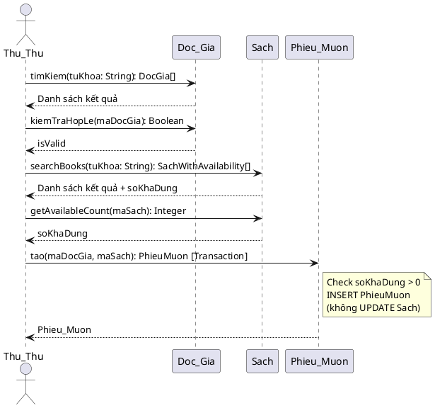

### UC02 - Trả sách

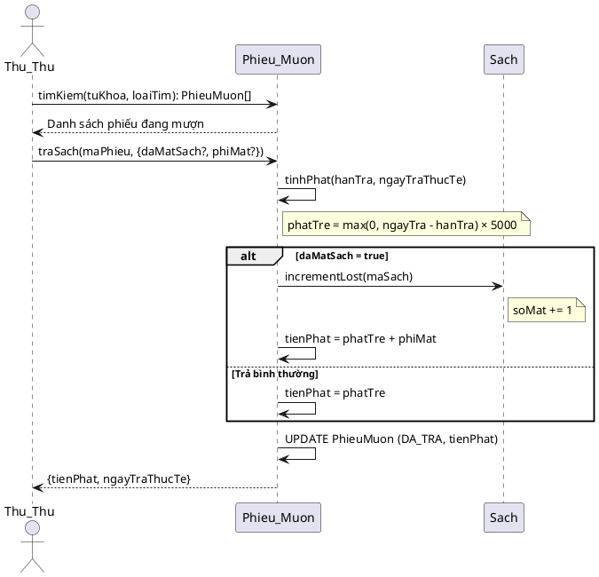

### UC03 - Gia hạn

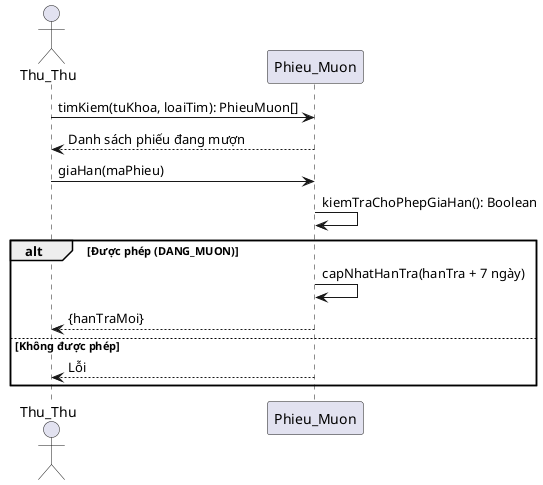

### UC04 - Quản lý tài khoản

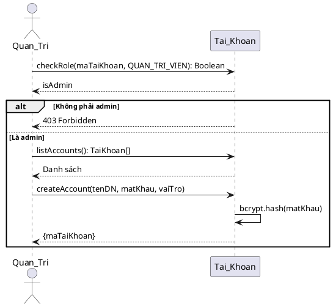

## 2c) Lược đồ lớp tổng quát lp-1

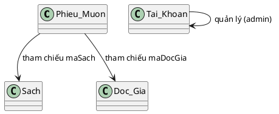

## 2d) Định nghĩa chi tiết các lớp

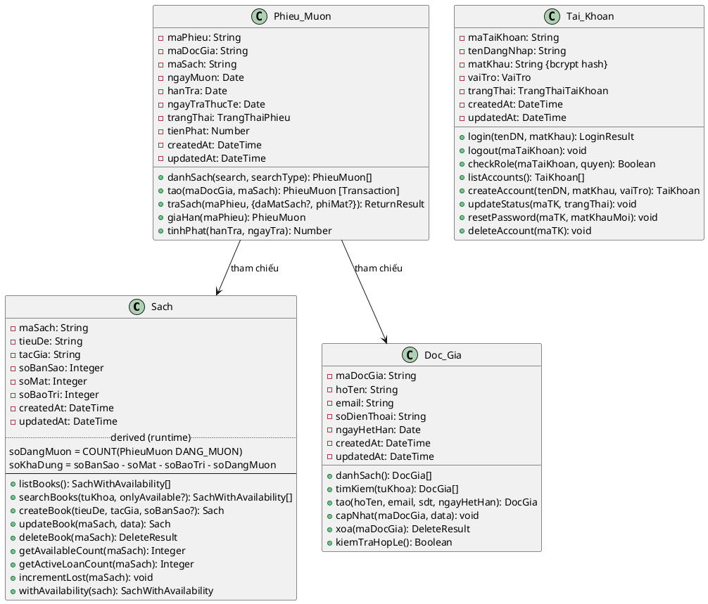

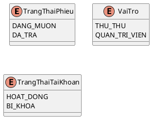

**Quy tắc nghiệp vụ:**
1. Tiền phạt trễ = soNgayQuaHan × 5000 VNĐ/ngày
2. Thời hạn mượn: 14 ngày
3. Gia hạn: +7 ngày vào hạn trả hiện tại
4. Mượn sách: soKhaDung > 0 (kiểm tra trong transaction)
5. Gia hạn: trangThai phải = DANG_MUON
6. Xóa độc giả: không có phiếu DANG_MUON
7. Xóa sách: soDangMuon = 0
8. Quản lý tài khoản: chỉ vaiTro = QUAN_TRI_VIEN mới được phép
9. Mật khẩu: hash bằng bcrypt (10 rounds)
10. Tạo phiếu mượn: sử dụng database transaction (atomic)
11. Trả sách có thể đánh dấu mất: tienPhat = phatTre + phiMat, soMat += 1

---

# PHẦN 3: THIẾT KẾ HỆ THỐNG

## 3a) Mô đun thiết kế

Kiến trúc phân lớp:

```
  Frontend (React SPA)  →  Axios (/api proxy dev)  →  Express API (port 3000)  →  SQLite
```

**Segmentation:**

| Mô đun | Đối tượng nghiệp vụ | API Routes |
|--------|---------------------|------------|
| mod-auth | Tai_Khoan (đăng nhập, phân quyền, CRUD tài khoản) | /auth/* |
| mod-borrow | Phieu_Muon (mượn, trả, gia hạn, tính phạt) | /loans/* |
| mod-reader | Doc_Gia (CRUD, tìm kiếm không dấu) | /readers/* |
| mod-book | Sach (CRUD, tìm kiếm không dấu, quản lý counters) | /books/* |
| mod-report | Báo cáo (quá hạn, tình trạng kho) | /reports/* |

**Factoring:**

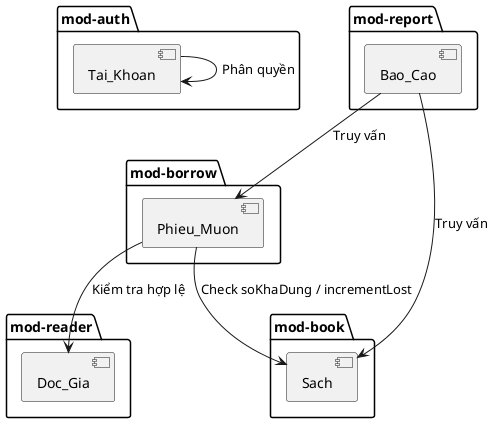

## 3b) Liên kết Giao diện - Xử lý - Database

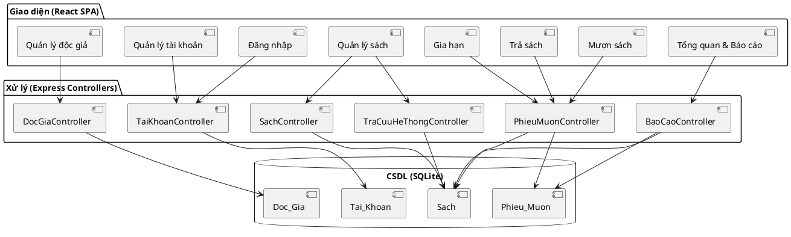

**Lược đồ quan hệ dữ liệu:**

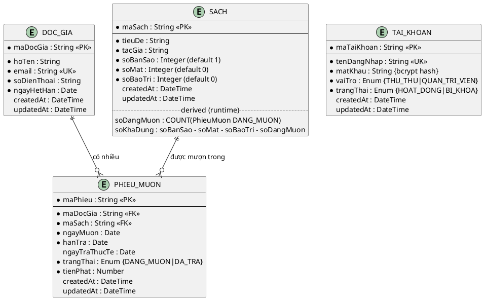

## 3c) Quy trình vận hành trên giao diện

**Layout:** Sidebar trái (3 nhóm: Menu chính, Quản lý, Báo cáo) + Header (tiêu đề trang) + Vùng nội dung

**Sidebar Menu:**
- MENU CHÍNH: Mượn sách, Trả sách, Gia hạn
- QUẢN LÝ: Sách, Độc giả, Tài khoản (Admin), Sao lưu (Admin)
- BÁO CÁO & THỐNG KÊ: Tổng quan

**Mượn sách** — Wizard 3 bước:
- Bước 1: Tìm độc giả (đa trường, không dấu) → bảng kết quả → Chọn
- Bước 2: Tìm sách (đa trường, không dấu) → bảng kết quả → Chọn (chỉ soKhaDung > 0)
- Bước 3: Xác nhận → Phiếu mượn

**Trả sách** — 2 bước:
- Bước 1: Tìm phiếu (dropdown loại tìm + từ khóa) → bảng phiếu + phạt ước tính → Chọn
- Bước 2: Xác nhận trả (hoặc đánh dấu mất + phí đền) → Kết quả (ngày trả, tiền phạt)

**Gia hạn** — 2 bước:
- Bước 1: Tìm phiếu (dropdown loại tìm + từ khóa) → bảng phiếu → Chọn
- Bước 2: Gia hạn +7 ngày → Hạn trả mới

**Quản lý sách:** Tìm kiếm + bảng CRUD + modal edit (soBanSao/soMat/soBaoTri number inputs) + không xóa được sách đang mượn (soDangMuon > 0)
**Quản lý độc giả:** Tìm kiếm (không dấu) + bảng CRUD + modal + DatePicker ngayHetHan + không xóa được độc giả đang mượn
**Quản lý tài khoản (Admin):** Bảng danh sách + Tạo mới (modal) + Khóa/Mở khóa + Đổi mật khẩu (modal) + Xóa
**Sao lưu dữ liệu (Admin):** Bảng danh sách file backup + Tạo backup ngay + Download file (auto-backup mỗi 24h trên production, giữ 7 bản gần nhất)
**Đăng nhập:** Form tên đăng nhập + mật khẩu, phân quyền Thủ thư / Quản trị viên
**Tổng quan:** Cards thống kê + Tabs (phiếu mượn gần đây, quá hạn, tình trạng kho)

## 3d) API Endpoints

| Method | Path | Mô tả | Phân quyền |
|--------|------|-------|-----------|
| POST | /auth/login | Đăng nhập | Public |
| POST | /auth/logout | Đăng xuất | Public |
| GET | /auth/accounts | Danh sách tài khoản | Admin |
| POST | /auth/accounts | Tạo tài khoản | Admin |
| PUT | /auth/accounts/:id/status | Khóa/Mở khóa | Admin |
| PUT | /auth/accounts/:id/password | Đổi mật khẩu | Admin |
| DELETE | /auth/accounts/:id | Xóa tài khoản | Admin |
| GET | /readers | Danh sách độc giả | All |
| GET | /readers/search | Tìm kiếm độc giả (không dấu) | All |
| POST | /readers | Tạo độc giả | All |
| PUT | /readers/:id | Cập nhật độc giả | All |
| DELETE | /readers/:id | Xóa độc giả | All |
| GET | /books | Danh sách sách (with computed soKhaDung, soDangMuon) | All |
| GET | /books/search | Tìm kiếm sách (không dấu) | All |
| POST | /books | Tạo sách | All |
| PUT | /books/:id | Cập nhật sách | All |
| DELETE | /books/:id | Xóa sách | All |
| GET | /loans | Danh sách phiếu mượn | All |
| POST | /loans | Tạo phiếu mượn | All |
| POST | /loans/:id/return | Trả sách (optional: {daMatSach, phiMat}) | All |
| POST | /loans/:id/extend | Gia hạn | All |
| GET | /reports/overdue | Báo cáo quá hạn | All |
| GET | /reports/inventory | Thống kê tình trạng kho | All |
| GET | /backups | Danh sách file sao lưu | Admin |
| POST | /backups/create | Tạo sao lưu ngay | Admin |
| GET | /backups/download/:name | Tải xuống file sao lưu | Admin |

## 3e) Xác thực và Phân quyền

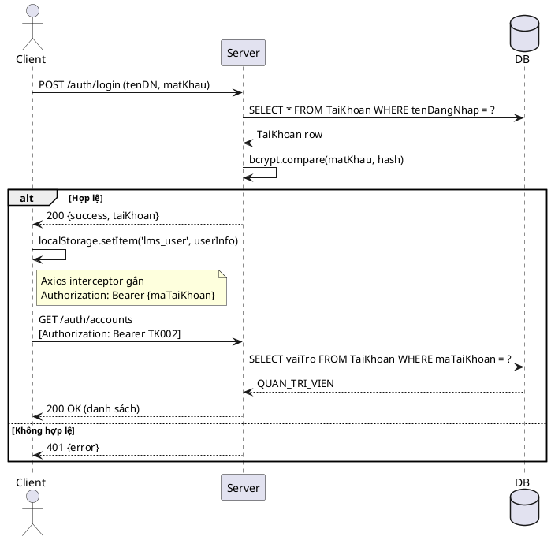

- Frontend lưu `{maTaiKhoan, tenDangNhap, vaiTro}` trong localStorage
- Axios interceptor tự gắn `Authorization: Bearer {maTaiKhoan}` vào mọi request
- Backend check quyền admin trực tiếp trong route handler (không middleware riêng)
